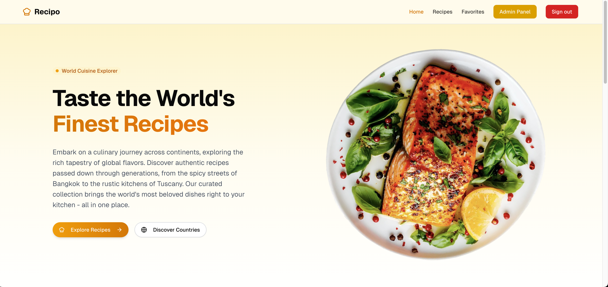
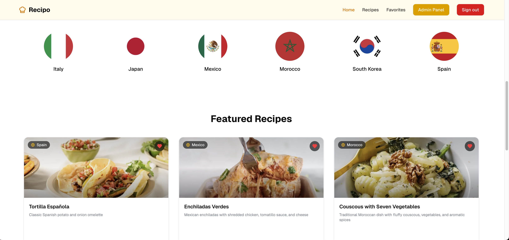
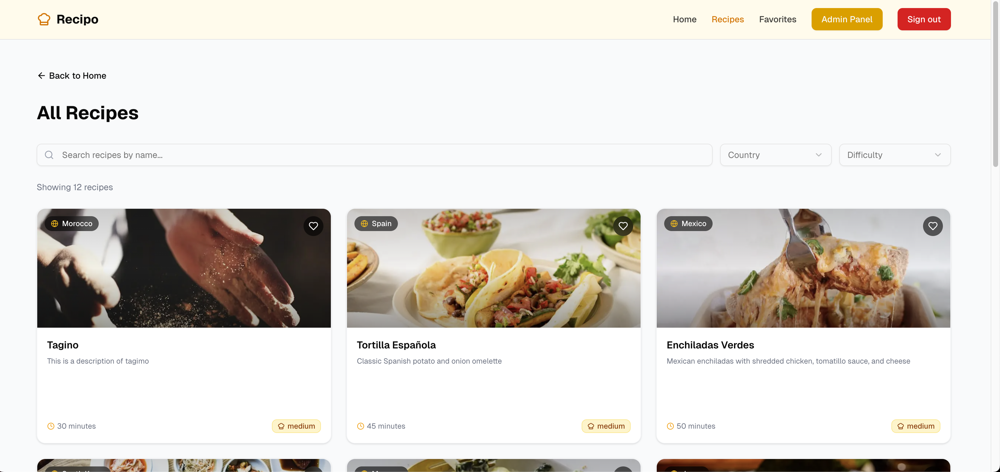
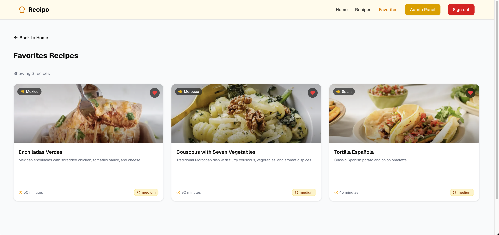
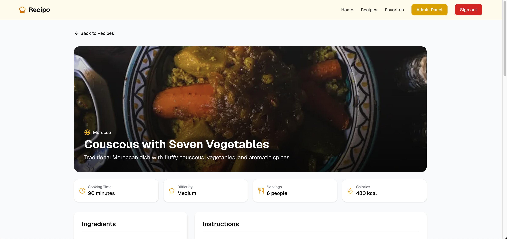
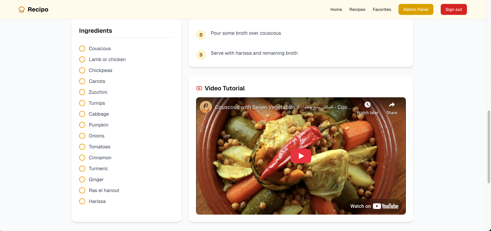
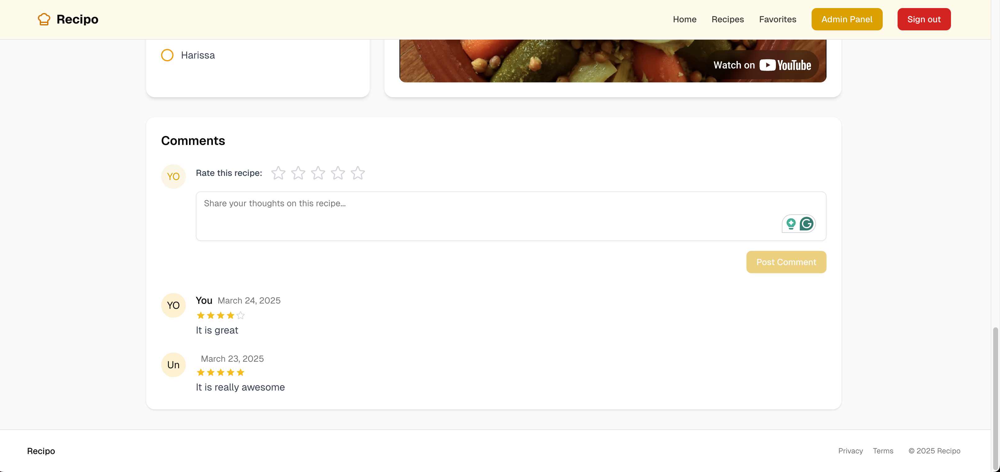
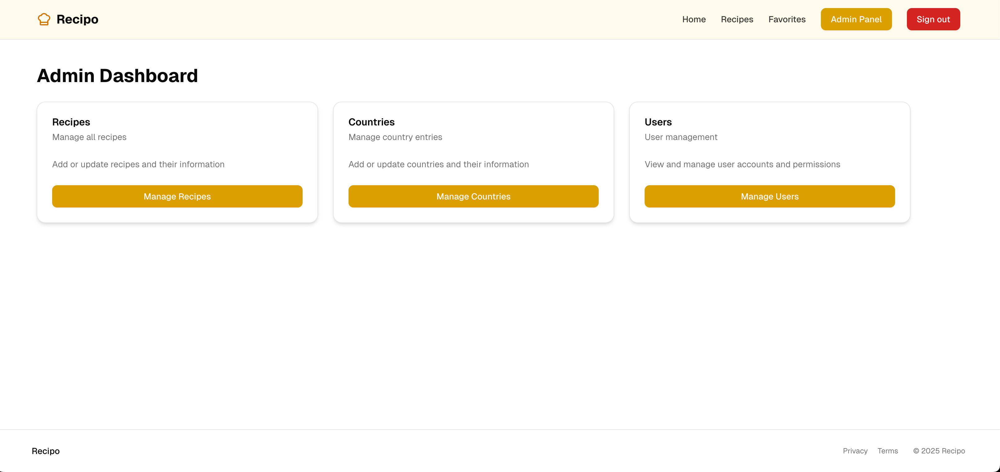
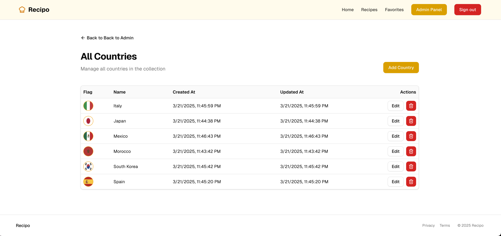

# 🔥 Recipo - Find Your Perfect Recipe

Recipo is your ultimate recipe finder web app that helps you discover delicious dishes from around the world! Browse recipes by country, save your favorites, and create your own culinary journey.

## 🚀 Features

- 🌍 **Country-based Recipe Search** - Find recipes specific to different countries and cultures
- 🔍 **Advanced Filtering** - Filter recipes by country or difficulty
- 👤 **User Accounts** - Login with email OTP or Google Auth
- 📱 **Responsive Design** - Works perfectly on desktop, tablet, and mobile devices
- ❤️ **Favorite Recipes** - Add the recipes you like to your favorites
- 🌟 **Rate or Comment** - Add a rating and comments to recipes
- 👑 **Admin Dashboard** - Manage recipes, countries, and users (admin access only)

## 🛠️ Tech Stack

- ⚛️ **Frontend**: Next.js 15, React 19, Tailwind CSS, Shadcn UI
- 🔐 **Authentication**: Better-Auth
- 💾 **Database**: PostgreSQL, Drizzle ORM
- 🧪 **Form Validation**: React Hook Form, Zod

## 🔧 Getting Started

### Prerequisites

- Node.js 18+
- npm or yarn
- PostgreSQL database (supabase, neon...)

### Installation

1. Clone the repository:

   ```bash
   git clone https://github.com/OmarJ9/recipo.git
   cd recipo
   ```

2. Install dependencies:

   ```bash
   npm install
   # or
   yarn install
   ```

3. Set up environment variables:
   Create a `.env` file in the root directory with:

   ```
   DATABASE_URL=your_postgresql_database_url
   BETTER_AUTH_SECRET=your_better-auth_secret
   BETTER_AUTH_URL=http://localhost:3000
   GOOGLE_CLIENT_ID=your_google_client_id
   GOOGLE_CLIENT_SECRET=your_google_client_secret
   ```

4. Migrate the database:

   ```bash
   npx drizzle-kit migrate
   # or
   yarn drizzle-kit migrate
   ```

5. Start the development server:

   ```bash
   npm run dev
   # or
   yarn dev
   ```

6. Open [http://localhost:3000](http://localhost:3000) in your browser.

## 🖥️ Showcase

Here are some screenshots showcasing the web application:











## 📚 Project Structure

```
recipo/
├── src/                  # Source files
│   ├── actions/          # Server actions
│   ├── app/              # App router components
│   │   ├── (auth)/       # Authentication routes
│   │   ├── admin/        # Admin dashboard
│   │   ├── recipes/      # Recipe-related pages
│   │   └── api/          # API routes
│   ├── components/       # UI components
│   ├── database/         # Database configurations
│   ├── hooks/            # Custom React hooks
│   ├── lib/              # Utility functions
│   └── types/            # TypeScript type definitions
└── public/               # Static files
```

# Star ⭐ the repo if you like what you see 😉.
